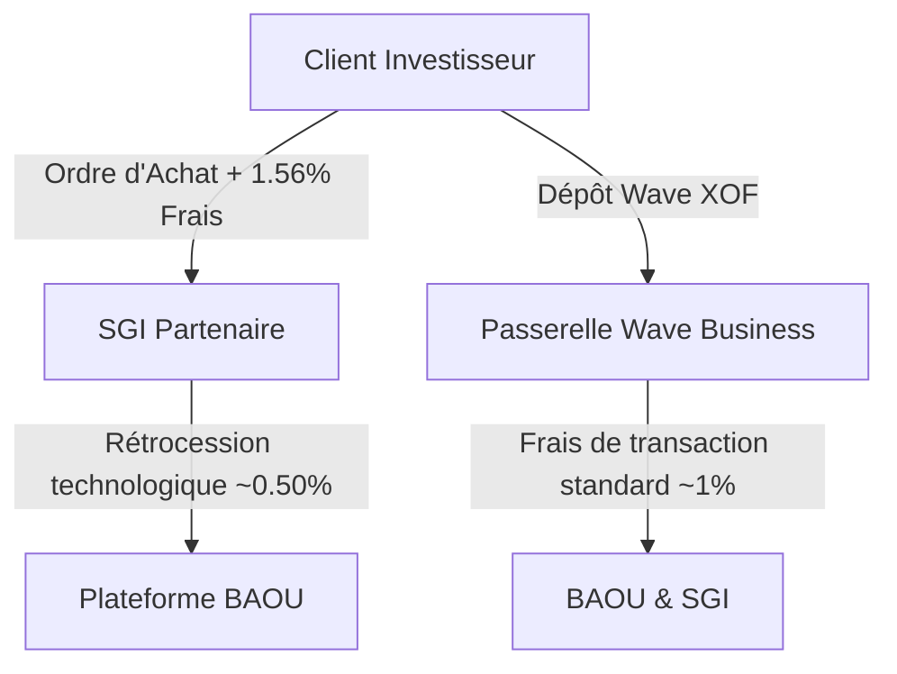

# BAOU FINANCE - DOSSIER STRATÉGIQUE & DE CONFORMITÉ
*À l'attention des Directions Générales des SGI partenaires, de la CDC-CI Capital et du Secrétariat Général de l'AMF-UMOA*

---

> [!NOTE]  
> **Vision BAOU :** Démocratiser l'actionnariat populaire en zone UMOA en connectant le moyen de paiement le plus utilisé (Wave Mobile Money) au marché financier régional (BRVM), en partenariat avec les SGI agréées.  
> **Signature de conformité :** ahdahmed45591@gmail.com

---

## 1. PRÉSENTATION EXECUTIVE (1 à 2 pages)

### L'Opportunité de Marché
La zone UMOA (Union Monétaire Ouest Africaine) connaît une pénétration historique de la finance mobile (*Mobile Money*), portée par des acteurs comme Wave. Cependant, l’accès à l’épargne productive et aux marchés d’actions de la BRVM (Bourse Régionale des Valeurs Mobilières) reste le privilège d’une minorité urbaine aisée. 

**BAOU** se positionne comme l'agrégateur technologique et le canal de distribution ultime, permettant de passer **« De Wave à la Bourse, en 2 clics »**.

```
[ Épargnant Ivoirien ] ──( Wave Mobile Money )──> [ Application BAOU ] ──( API SGI Agréée )──> [ Marché BRVM ]
```

### Proposition de Valeur
*   **Pour le grand public :** Une application mobile intuitive pour s'inscrire, faire valider son KYC, charger son compte en XOF via Wave, et acheter des actions de grandes entreprises (Sonatel, Société Générale CI, Ecobank, etc.) à partir de montants modestes.
*   **Pour les SGI :** Un apport massif de nouveaux clients digitaux (mass retail) et un volume d'ordres BRVM démultiplié sans surcharge opérationnelle.
*   **Pour la CDC-CI Capital :** Un outil d'inclusion financière unique s'alignant sur la politique nationale de mobilisation de l'épargne domestique pour le financement de l'économie réelle.

---

## 2. LE PROBLÈME RÉSOLU POUR LES SGI

Aujourd'hui, les SGI (Sociétés de Gestion et d'Intermédiation) font face à d'importants goulots d'étranglement opérationnels :

| Obstacles Actuels des SGI | Solution Apportée par BAOU |
| :--- | :--- |
| **Coût d’acquisition client (CAC) élevé** | Tunnel de conversion mobile optimisé touchant des millions d'utilisateurs actifs de Wave. |
| **Processus KYC papier & physique lourd** | Numérisation complète des pièces justificatives (CNI, Selfie, Justificatif de domicile) via l'application. |
| **Paiements par chèque ou virement bancaire** | Intégration de la passerelle Wave Business pour des dépôts et retraits XOF instantanés et sécurisés. |
| **Traitement manuel des ordres modestes** | Acheminement automatisé des intentions d'achats/ventes vers la console d'administration de la SGI. |

---

## 3. PROTOTYPE & DÉMONSTRATION FONCTIONNELLE

Le produit BAOU est d'ores et déjà opérationnel et testable sous trois déclinaisons :

### A. L'Application Mobile Cliente (BAOU App)
*   **Authentification et KYC digitalisé** : Inscription simplifiée avec transmission automatisée des justificatifs réglementaires pour validation par la SGI.
*   **Module de Trading Instantané** : Fiche valeur réactive avec calcul automatique des commissions réglementaires de la SGI (frais de courtage fixés à 1,56% TTC).
*   **Passerelle Wave intégrée** : Dépôts instantanés pour alimenter le compte cash, et retraits sécurisés limités au numéro de compte vérifié pour éviter toute fraude.

### B. Le Portail de Contrôle d'Administration (SGI Console)
*   **Validation KYC** : Interface de revue des pièces d'identité pour validation ou rejet motivé du dossier.
*   **Gestion du Carnet d'Ordres** : Réception des ordres des clients et validation pour transmission sur le marché BRVM.
*   **Suivi de la Passerelle Wave** : Vue récapitulative des mouvements de fonds et gestion des litiges.
*   **Transmission de documents PDF** : Envoi de documents officiels (conventions de comptes, relevés de portefeuille) directement sur l'application mobile du client.

### C. La Version APK Démo Autonome (Offline Demo)
*   *Disponible via GitHub Actions* : Une version de démonstration ne requérant aucune connexion internet, embarquant un moteur de simulation locale du marché BRVM et des flux Wave. Idéale pour les présentations en clientèle ou les démonstrations physiques dans les locaux de la CDC-CI ou des SGI.

---

## 4. MODÈLE ÉCONOMIQUE (BUSINESS MODEL)

Le modèle économique de BAOU repose sur un partage de valeur vertueux ne grevant pas les marges des SGI et transparent pour l'investisseur :



### Sources de revenus :
1.  **Rétrocession sur Courtage (Frais BRVM) :** Sur chaque transaction exécutée, la SGI perçoit ses frais de courtage réglementaires. BAOU perçoit une commission de rétrocession technologique (apporteur d'affaires / SaaS transactionnel).
2.  **Abonnement SGI (Mode SaaS White-Label) :** Option de facturation mensuelle de la console d'administration pour les SGI souhaitant intégrer BAOU comme leur portail client officiel personnalisé.

---

## 5. CADRE RÉGLEMENTAIRE (AMF-UMOA) & SÉCURITÉ

La conformité avec la réglementation financière de l'Union Monétaire Ouest Africaine est inscrite dans l'architecture même de BAOU.

### Positionnement vis-à-vis de l'AMF-UMOA
> [!IMPORTANT]  
> **Pas de détention de fonds ni de titres :** BAOU n'est ni une banque, ni une SGI. BAOU ne détient jamais les fonds des clients (hébergés chez le partenaire bancaire de la SGI) ni les titres (inscrits au DC/BR). 

*   **Statut Réglementaire Ciblé :** BAOU postule au statut d'**Apporteur d'Affaires** ou d'**Intermédiaire en Opérations de Bourse (IOB)** conformément aux instructions du régulateur AMF-UMOA.
*   **Conformité KYC/AML (Lutte contre le blanchiment) :** Le processus d'inscription intègre la collecte et l'archivage sécurisé des pièces requises. Aucun ordre n'est autorisé en base de données tant que le statut du client n'est pas manuellement marqué comme **`APPROUVE`** par l'officier de conformité de la SGI.
*   **Pistes d'Audit & Sécurité :**
    *   Signature d'empreinte électronique sur tous les flux de données.
    *   Journal d'audit (`AuditLog`) enregistrant l'origine IP de chaque action clé (dépôt, ordre, validation administrative).
    *   Retrait restrictif : Les retraits de fonds ne sont autorisés que vers le numéro de téléphone Wave officiellement validé lors de la sousmission du profil client, éliminant le risque de détournement de fonds vers un compte tiers.

---
*Dossier stratégique produit par le bureau de liaison technique BAOU Finance.*  
*Contact conformité et développement : [ahdahmed45591@gmail.com](mailto:ahdahmed45591@gmail.com)*
